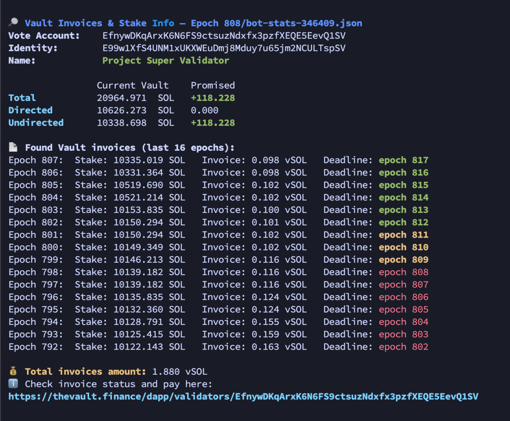

# 🧾 Vault Invoices Checker

A lightweight Bash script that fetches and displays **Vault stake info** and **pending invoice amounts** for a given Solana vote account.

<p align="center">
  
</p>

---

## 🛠 Features

- ✅ Shows current and promised **Vault stake** (total, directed, and undirected)
- ✅ Highlights **delta** (increase/decrease) in stake with colors
- ✅ Displays a list of recent **Vault invoices** for the selected number of epochs
- ✅ Highlights invoice **deadlines** based on urgency:
  - 🔴 overdue
  - 🟡 due soon
  - 🟢 safe
- ✅ Useful for:
  - reviewing current stake obligations
  - estimating your **cost of Vault stake** for a selected number of epochs
  - reminding yourself of **unpaid invoices**

⚠️ **Note**: This version does **not** show the payment status of invoices — only whether they exist and how much is owed in `vSOL`.

---

## 📦 Output Example

The script prints:

- Validator name, identity, vote account
- A compact table:
  - **Current Vault stake**
  - **Promised stake**
  - Color-coded **delta**
- Invoice list for the last N epochs:
  - Stake amount in SOL
  - Invoice amount in `vSOL`
  - Deadline with color (based on urgency)
- Total vSOL owed (summed from all unpaid invoices found)

---

## 🧪 Usage

```bash
./vault-invoices-checker.sh &lt;vote_account_address&gt; [epochs_to_check]
```

- `vote_account_address`: required — the validator's vote account pubkey
- `epochs_to_check`: optional — how many past epochs to check (default: `15`)

### 🔍 Example:

```bash
./vault-invoices-checker.sh 5jYEhZXYZabcDEFghijLMNoPQRstuVWxyZ123456 20
```

---

## 📋 Requirements

This script depends on:

- `bash`
- `curl`
- `jq`
- `awk`

Make sure all are available in your environment. On Ubuntu/Debian, you can install them with:

```bash
sudo apt install curl jq gawk
```

---

## 🔗 Links

- 💼 Vault UI: [https://thevault.finance](https://thevault.finance)
- 🧠 Learn more: [Vault Stakebot GitHub](https://github.com/SolanaVault/stakebot-data)
- 📘 Script repo: [github.com/AndrewInUA/vault-invoices-checker](https://github.com/AndrewInUA/vault-invoices-checker)

---

## 🪪 License & Usage

This script is open-source and freely available for use, modification, and redistribution under the terms of the MIT License.

You are welcome to:

- 🔄 Adapt or extend it for your own validator operations
- 🤝 Share it with other operators or contributors
- ⭐️ Star the repository if you find it useful

Attribution is appreciated but not required.

---

## 👤 Author

Made with ❤️ by **[AndrewInUA](https://andrewinua.com)** — a Solana validator building transparent tools for the community.
